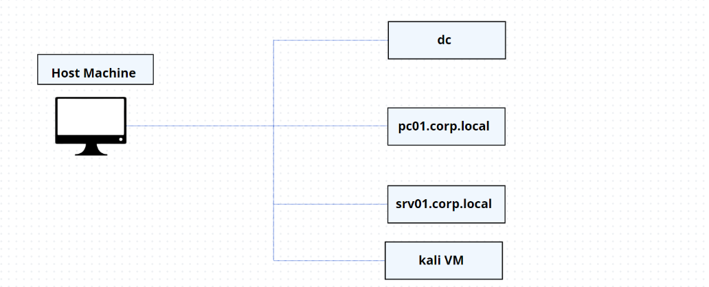
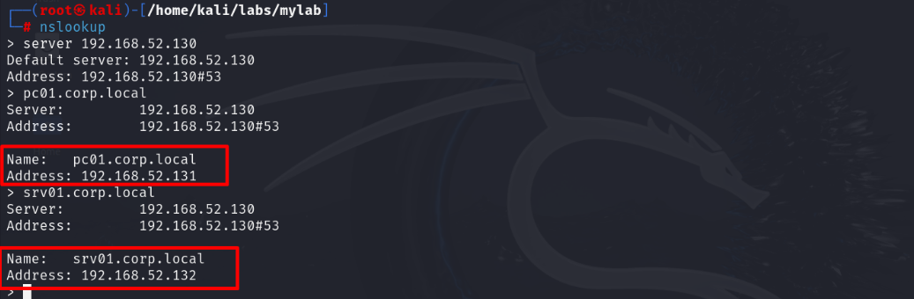

## Lab OverView
<br>

##### Domain Controller
```
ip: 192.168.52.130
dnsname: WIN-4E30GDH8UQ6.corp.local
user: Administrator
pass: Password321!
```

##### PC01
```
ip: 192.168.52.131
dnsname: pc01.corp.local
user: localadmin
pass: Password123!
```

##### SRV01
```
ip: 192.168.52.132
dnsname: srv01.corp.local
user: Administrator
pass: Password123!
```

##### Dns Verification
<br>