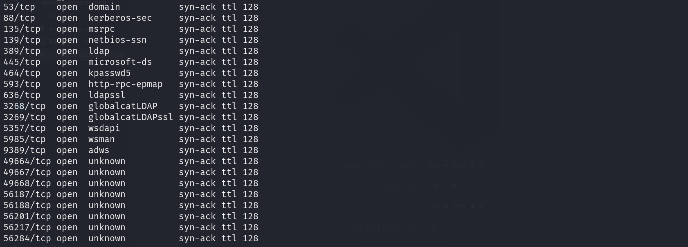
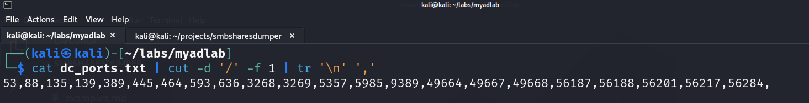
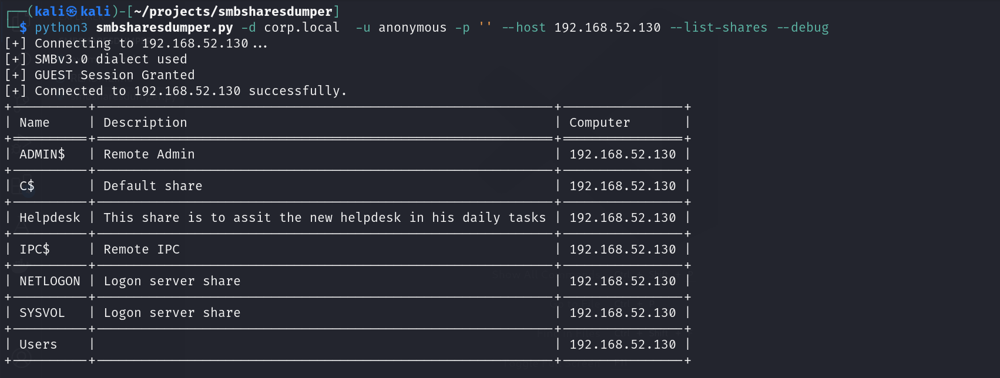
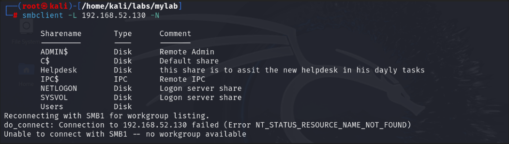
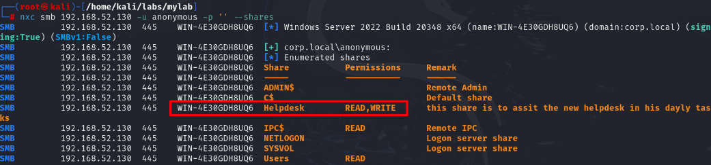
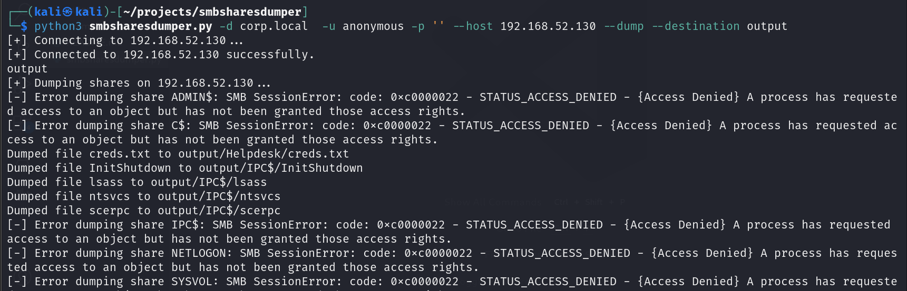
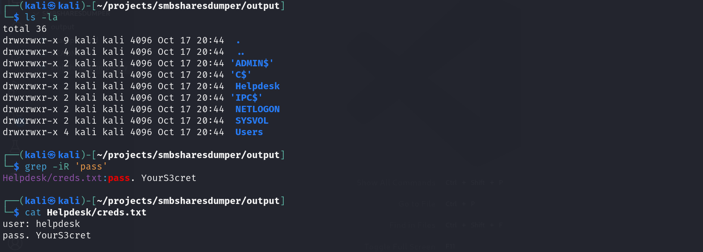
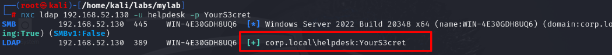

### Ports Scanning
```sh
rustscan -a 192.168.52.130,192.168.52.131,192.168.52.132
```
<br>

```sh
cat ports.txt | cut -d '/' -f 1 | tr '\n' ','
```
<br>

```sh
nmap -p<seqence_of_ports> -sC -sV -v -oN dc.full 192.168.52.130
```

### Smb Enumeration
```sh
python3 smbsharesdumper.py -d corp.local  -u anonymous -p '' --host 192.168.52.130 --list-shares --debug

nxc smb 192.168.52.130 -u anonymous -p '' --shares

smbclient -L 192.168.52.130 -N
```
<br>
<br>
<br>

```sh
python3 smbsharesdumper.py -d corp.local  -u anonymous -p '' --host 192.168.52.130    --dump --destination output

smbclient \\\\192.168.52.130\\Helpdesk -U anonymous
```
<br>
<br>

```
user: helpdesk
pass: YourS3cret
```
### Creds Verification
```sh
nxc smb 192.168.52.130 -u helpdesk -p YourS3cret
```


### Note:
```
Members of helpdesks group (helpdesk) are local administrators on pc01. So this machine can be used as foothold on the taget active directory environement. 

With that being said future attacks an enumeration can be preformed form pc01 or from kali or even the host machine (Domain Non Joined Machine).
```