### Domain Users
```sh
python3 ldapad.py usersenum -d corp.local -u helpdesk -p YourS3cret
```
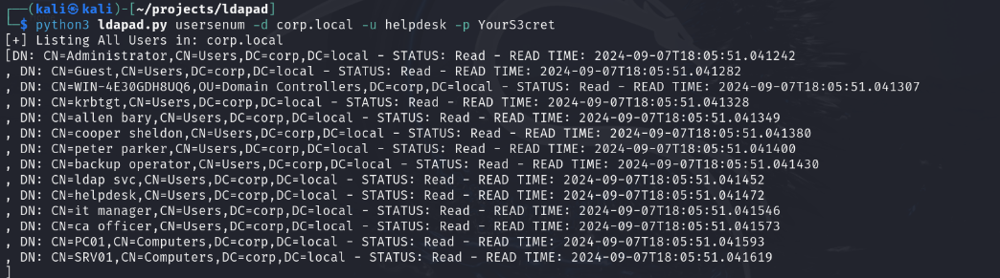<br>

```sh
ldapdomaindump  'ldap://corp.local' -u 'corp.local\helpdesk' -p 'YourS3cret' -o lootme
```
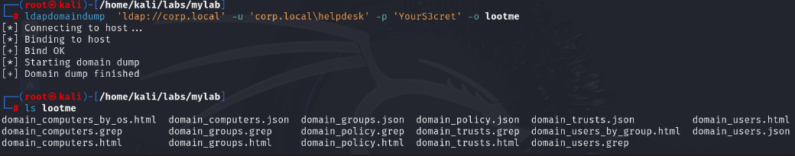<br>

```sh
GetADUsers.py -all corp.local/helpdesk:YourS3cret -dc-ip $dc
```
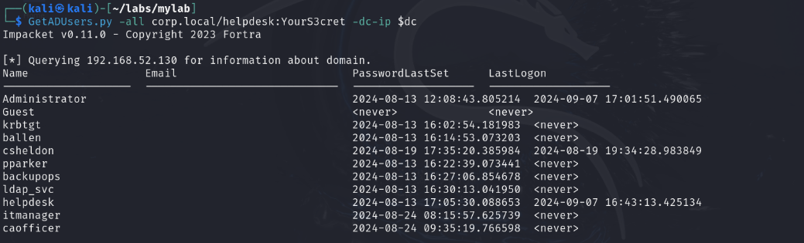<br>

```powershell
Get-DomainUser -Domain $domain -Server $dc -Credential $helpdesk | select samaccountname, description
```
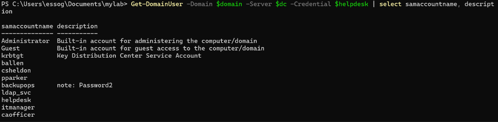<br>


### Domain Groups
```sh
python3 ldapad.py groupsenum -d corp.local -u helpdesk -p YourS3cret
```
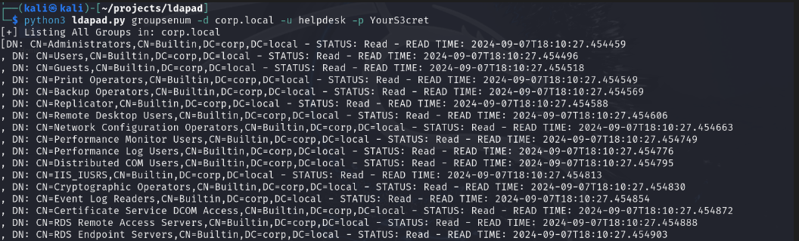<br>

```powershell
Get-DomainGroup -Domain $domain -Server $dc -Credential $helpdesk | select samaccountname
```
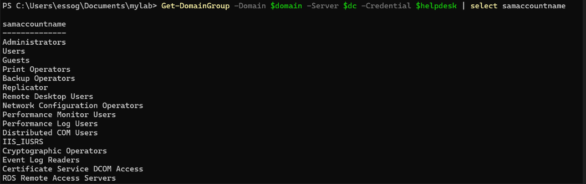<br>

### Domain Computers
```powershell
Get-DomainComputer -Domain $domain -Server $dc -Credential $helpdesk | select samaccountname
```
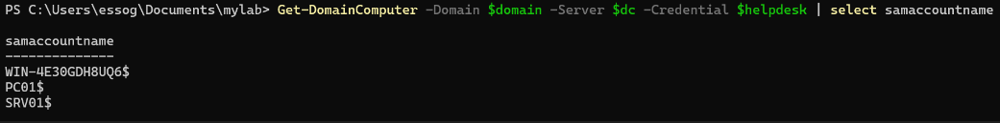<br>

### Group Policy Objects
```powershell
Get-DomainGPO -Domain $domain -Server $dc -Credential $helpdesk | select displayname
```
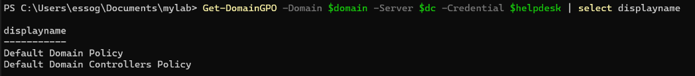<br>

### ACLs

```powershell
Get-DomainObjectAcl -SearchBase "DC=corp,DC=local" -Credential $helpdesk -Domain $domain -Server $dc | Where-Object {($_.ActiveDirectoryRights -match "GenericAll|GenericWrite|WriteDacl") -and ([int]($_.SecurityIdentifier.Value.Split('-')[-1]) -ge 1000)}
```
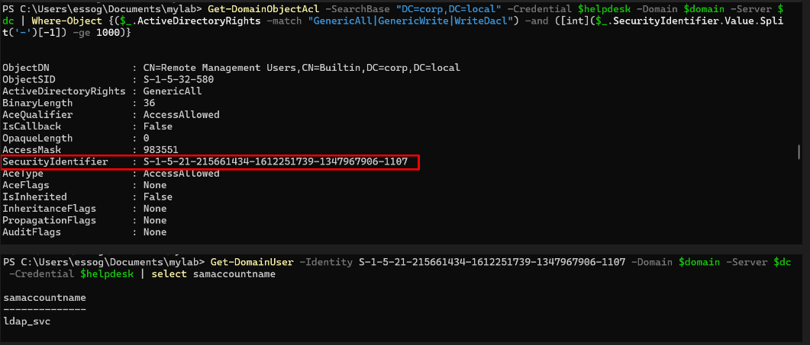<br>

```powershell
Find-InterestingDomainAcl -ResolveGUIDs | ?{$_.IdentityReferenceName -match "ldap_svc"}
```

### Kerberos Attacks Enumeration
```powershell
Get-DomainUser -PreAuthNotRequired -Domain $domain -Server $dc -Credential $helpdesk | select samaccountname
```
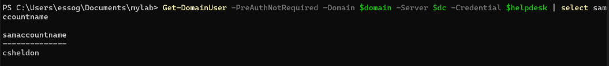<br>

```powershell
Get-DomainUser -SPN -Domain $domain -Server $dc -Credential $helpdesk | select samaccountname
```
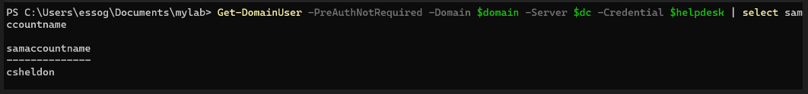<br>

```powershell
Get-DomainUser -Unconstrained -Domain $domain -Server $dc -Credential $helpdesk | select samaccountname

Get-DomainUser -Unconstrained -Domain $domain -Server $dc -Credential $helpdesk | select samaccountname
```
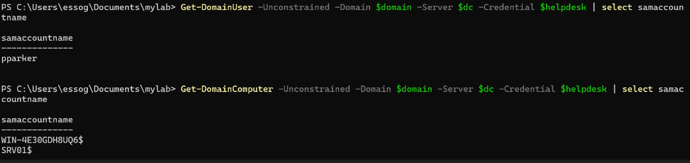<br>

```powershell
Get-DomainComputer -TrustedToAuth -Domain $domain -Server $dc -Credential $helpdesk | select samaccountname, msds-allowedtodelegateto

Get-DomainUser -TrustedToAuth -Domain $domain -Server $dc -Credential $helpdesk | select samaccountname, msds-allowedtodelegateto
```
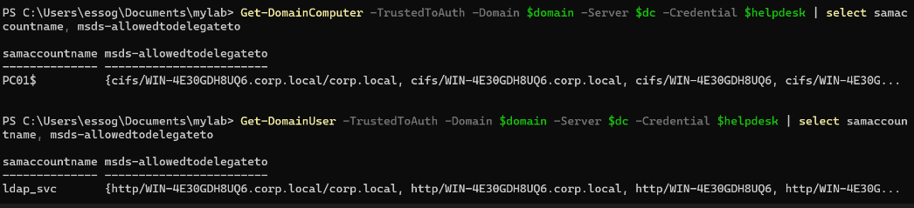<br>