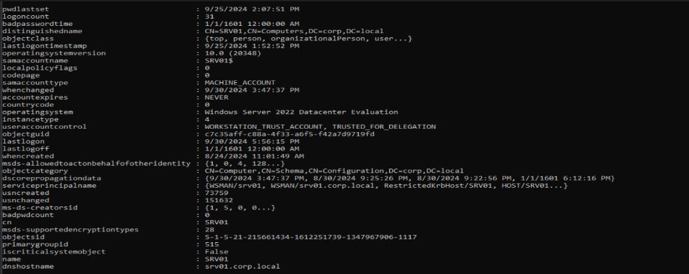

### Path1

backup operators group to Domain admin: we have backupops user has his password is description. this backup operators group member can used to escalate to da.
 

### Path2

helpdesk user, a member of Remote Management Users Group has WriteDacl on the top level domain. We can leverage this to grant helpdesk replication rights and then perform dcsync...
 
 

### Path3

We (helpdesk) has local admin access on pc01 and this machine is allowed to delegate kerberos authentication to CIFS service on the DC...

 
 

### Path4

itmanager is domain admin and has a session on srv01. we (helpdesk) is local admin access on srv01, we can extract itmanager hashes and thus get domain admin access...

### Path5

srv01 is trusted to delegate kerberos authentication to any service in domain (Unconstrained delatation). since we have local admin access on srv01 we can exploit this with the Printer bug to get the dc machine account hash...

 
 

### Path6
 

### Path7

### Path8

### Path9

### Path10

### Path11

### Path12

### Path13

### Path14

### Path15

### Path1

