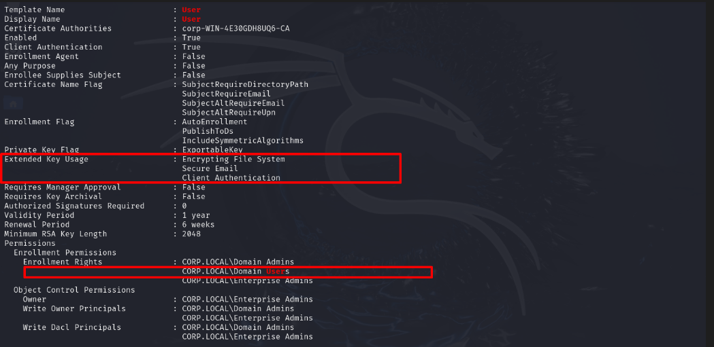

### Path1

backup operators group to Domain admin: we have backupops user has his password is description. this backup operators group member can used to escalate to da.
 

### Path2

helpdesk user, a member of Remote Management Users Group has WriteDacl on the top level domain. We can leverage this to grant helpdesk replication rights and then perform dcsync...
 
 

### Path3

We (helpdesk) has local admin access on pc01 and this machine is allowed to delegate kerberos authentication to CIFS service on the DC...

 
 

### Path4

itmanager is domain admin and has a session on srv01. we (helpdesk) is local admin access on srv01, we can extract itmanager hashes and thus get domain admin access...

### Path5

srv01 is trusted to delegate kerberos authentication to any service in domain (Unconstrained delatation). since we have local admin access on srv01 we can exploit this with the Printer bug to get the dc machine account hash...

 
 

### Path6
ldap_svc is allowed to delagate authentication to http service on the dc. We can leverage this to access winrm as domain admin on the dc...

Recall: We have compromised ldap_svc using kerberoasting
 

### Path7
pparker has Unconstrained delegation enabled. Using pparker we can access dc services ldap(dcsync), http(winrm) ...etc as domain admin.

Recall: We have compromised ppacker using kerberoasting.
 

### Path8
ESC1: Members of the IT group has enrollement rights on DevelopementCodeSigning Template. The Template has EnrolleeSuppliesSubject and can be used for kerberos authentication.
 

### Path9
ESC2: Domain Users have enrollement rights on esc2 template. The esc2-A template can be used for any purpose (including kerberos authentication). On top of all that the template has EnrolleeSuppliesSubject enabled...
 

### Path10
ESC3: Members of helpdesks group (helpdesk) has enrollement rights on ESC3-EA template. The EKU is "Certificate Request Agent" meaning a certificate from this template can be used to request another certificate (ESC3-Users or the default User Template) on behalf of any users including DAs
 
 

### Path11
ESC2 and ESC3: Domain Users have enrollement rights on esc2-B template. The esc2-B template can be used for any purpose (including as Certificate Request Agent). Using this we can request the default User template certificate as DA.
 
 

### Path12
ESC4: Members of helpdesks (helpdesk) has GenericAll right on the esc4 template. Using this we can reconfigure the template back to ESC1 senarios...
 

### Path13
ESC7-A: ManageCA we can change the CA config to allow enrollees to supply alrternative names in thier csr (ESC6) EDITF_ATTRIBUTESUBJECTALTNAME2 (needs CA cersive restart).

NB: If we have ManageCA right we can grant ourself ManageCertificate rights...(We then fall into path14)
 

### Path14
ESC7-B: ManageCertificates => Bypass Manager approval.
The SubCA Template is vulnerable to ESC1 (EnrolleeSuppliesSubject) but only admins can enroll.
- Request a certificate onbehalf of administrator using the subCA Template (this will fail but we save the private key).
- Use ManageCertificate Rights to issue the failed certificate.
- Retrive the issued certificate.

 
 